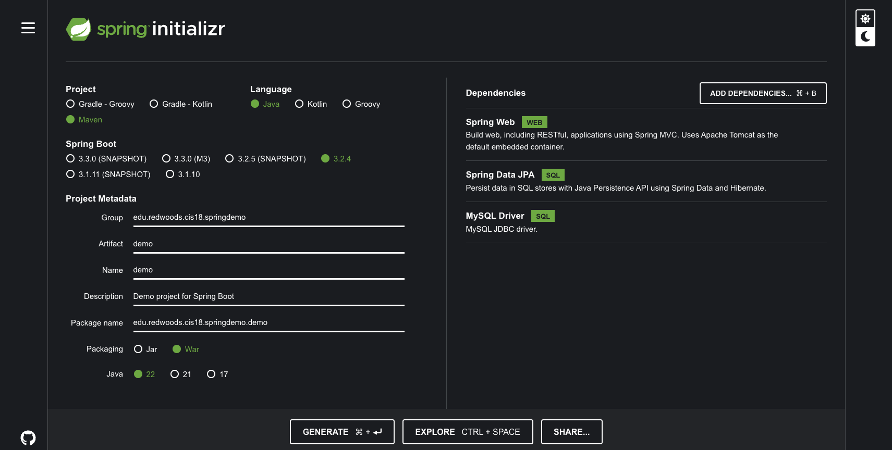

# MySQL SpringBoot Demo

This guide walks you through the process of creating a Spring application connected to a MySQL Database
* It uses Spring Data JPA to access the database
* Spring Data JPA Requires the MySQL Driver to connect, but Spring JDBC could also be used.

## Manual Steps



1. Use Spring Boot Initializer to create a default project.
    * Navigate to https://start.spring.io.
    * This service pulls in all the dependencies you need for an application and does most of the setup for you.
    * Choose Maven and Java.
    * Click Dependencies and select Spring Web, Spring Data JPA, and MySQL Driver.
    * Click Generate.
    * The resulting ZIP file, which is an archive of a web application with your choices will be downloaded.
2. Create the Database
    * This is beyond the scope of this article, so on your system figure out how to download and install MySQL server.
    * Then use a database client, I prefer DBeaver (a free GUI client), to create a database named **SpringDemo**
    * Next, create a SQL Script and execute the following commands to set up an **application user** for your database.
```sql
CREATE USER 'springuser'@'%' identified by 'YourSecretPassword'; -- Creates the user
GRANT ALL on SpringDemo.* to 'springuser'@'%';                   -- Gives all privileges to the new user on the newly created database
```
3. Create the application.properties File
    * Spring Boot gives you defaults on all things. For example, the default database is H2. Consequently, when you want to use any other database, you must define the connection attributes in the **application.properties** file.
    * view this file for an example: [application.properties](src/main/resources/application.properties)
        * **spring.jpa.hibernate.ddl-auto** can be none, update, create, or create-drop. See the Hibernate documentation for details.
        * You must begin with either create or update, because you do not yet have the database structure. After the first run, you can switch it to update or none, according to program requirements.
        * Use update when you want to make some change to the database structure.
```text
none: The default for MySQL. No change is made to the database structure.
update: Hibernate changes the database according to the given entity structures.
create: Creates the database every time but does not drop it on close.
create-drop: Creates the database and drops it when SessionFactory closes.
```

## Create the @Entity Model

You need to create the User entity model, as done in this project [User.java](src/main/java/edu/redwoods/cis18/springdemo/demo/model/User.java).
* Hibernate (which is used by SpringBoot JPA) automatically translates the entity into a table.

## Create the Repository
You need to create the repository that holds user records [UserRepository.java](src/main/java/edu/redwoods/cis18/springdemo/demo/model/UserRepository.java).
    * Spring automatically implements this repository interface in a **bean** that has the same name (with a change in case, it is called userRepository).
    * Imagine a Java bean like a little container in your code. It follows a set of rules to hold information (like properties) and lets you access it easily using methods (like get and set). This makes your code more organized and reusable.

## Create a Controller
You need to create a controller to handle **HTTP** requests to your application [MainController.java](src/main/java/edu/redwoods/cis18/springdemo/demo/controller/MainController.java).
    * Our Controller explicitly specifies **POST** and **GET** for the two endpoints.
    * By default, @RequestMapping maps all **HTTP** operations.

## Create an Application Class
Spring Initializr creates a simple class for the application, [DemoApplication.java](src/main/java/edu/redwoods/cis18/springdemo/demo/DemoApplication.java).

## Build Your Executable War of Jar
```bash
mvn spring-boot:run
# Alternatively, you can build the JAR file with
mvn clean package
# and then run the JAR file, as follows:
java -jar target/demo-0.0.1-SNAPSHOT.war
```

## Test the Application

* Now that the application is running, you can test it by using curl or similar tool.
* You have two **HTTP endpoints** that you can test:
    * GET localhost:8080/demo/all: Gets all data.
    * POST localhost:8080/demo/add: Adds one user to the data.

* The following curl command adds a user:
    * The reply should be **Saved**
```bash
curl -d name=Trevor -d email=trevor-hartman@redwoods.edu http://localhost:8080/demo/add
```

* The following command shows all the users:
    * The reply should be similar to ```[{"id":1,"name":"Trevor","email":"trevor-hartman@redwoods.edu"}]```
```bash
curl http://localhost:8080/demo/all
````

## Make Some Security Changes

1. It is a good security practice to, after your database is in a production state, to set **spring.jpa.hibernate.ddl-auto=none** in **application.properties** to none, revoke all privileges from the MySQL user connected to the Spring application, and give the MySQL user only SELECT, UPDATE, INSERT, and DELETE. The following command revokes all the privileges from the user associated with the Spring application:
```sql
REVOKE ALL ON SpringDemo.* from 'springuser'@'%';
```
2. Now the Spring application cannot do anything in the database, but the application must have some privileges...
3. Use the following command to grant the **minimum** privileges the application needs:
```sql
GRANT select, insert, delete, update ON SpringDemo.* to 'springuser'@'%';
```
    * Removing all privileges and granting some privileges gives your Spring application the privileges necessary to make changes to only the data of the database and not the structure (schema).

???+note
    When you want to make changes to the database, simply re-grant permissions.
    Change the **spring.jpa.hibernate.ddl-auto** setting in **application.properties** to update, and re-run your application.